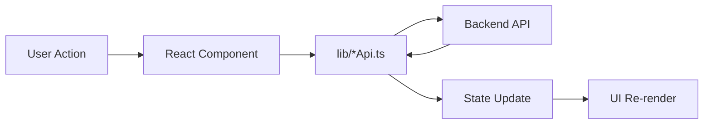

# Kuberns Frontend

Frontend application for Kuberns cloud deployment platform.

## 1. What This App Does

- Handles authentication UI (register/login/OTP).
- Connects GitHub repositories.
- Runs a 2-step "Create New App" flow.
- Lists webapps, deployment status, and logs.
- Triggers deployment start and tracks progress.
- Provides dark/light theme and responsive layout.

## 2. Tech Stack

- React 18 + TypeScript
- Vite
- React Router
- Tailwind CSS
- Lucide icons
- Fetch API (cookie-based auth requests)

## 3. Setup Instructions

### Prerequisites

- Node.js 18+ (20 recommended)
- Backend service running

### Install

```bash
cd kuberns-app
npm install
```

### Environment

Create `.env`:

```env
VITE_API_BASE_URL=http://localhost:5000
```

### Run

```bash
npm run dev
```

Build:

```bash
npm run build
```

Preview build:

```bash
npm run preview
```

## 4. Frontend Architecture

### High-level

```text
UI Components
  -> API Clients (authApi / githubApi / webappApi)
  -> Backend REST endpoints
```

### Runtime Flow



### Source Structure

```text
src/
  main.tsx
  App.tsx
  components/
    Layout.tsx
    AuthPage.tsx
    Screen1.tsx
    Screen2.tsx
    WebappsPage.tsx
    ui/
  contexts/
    ThemeContext.tsx
  lib/
    authApi.ts
    githubApi.ts
    webappApi.ts
  types/
```

### Frontend Layering

The frontend follows a lightweight layered structure:

```text
Pages/Container Components
  -> Presentational Components
  -> API Client Layer (lib/*.ts)
  -> Backend
```

- Container components (`App.tsx`, `Screen1.tsx`, `WebappsPage.tsx`) orchestrate data flow and side effects.
- Presentational components focus on UI rendering and local interactions.
- API clients (`authApi`, `githubApi`, `webappApi`) isolate HTTP protocol details.

This keeps fetch logic out of UI-heavy components and makes behavior easier to reason about.

### State Management Strategy

- Global app state:
  - Authentication/session state in `App.tsx`.
  - Theme state in `ThemeContext`.
- Feature-local state:
  - Form step state (`currentStep`) and create-form payload.
  - Deployment detail/log loading states inside webapp pages.
- URL state:
  - Router path controls primary screen.
  - Route state carries auto-deploy handoff (`autoDeployWebAppId`, `autoDeployDeploymentId`).

### Dependency and Control Flow

- UI depends on typed API clients only.
- API clients depend on `fetch` and typed response parsing.
- Components do not call backend URLs directly.

This dependency direction prevents tight coupling between UI markup and transport logic.

## 5. UI and State Design Decisions

- App-level orchestration is in `App.tsx`:
  - auth session bootstrap (`/auth/me`)
  - route guarding
  - create-flow step control
  - post-create redirect + auto-deploy handoff
- API concerns are isolated in `src/lib/*Api.ts`.
- Components are mostly presentation + local interaction state.
- Cookies are used for auth (`credentials: include` on requests).
- Theme state is centralized in `ThemeContext`.

### Route Composition Decision

`App.tsx` acts as composition root for frontend behavior:

- Injects handlers (`onLogout`, `onOpenWebapps`, `onAddNew`) into shared `Layout`.
- Controls protected vs public route rendering.
- Centralizes post-auth and post-create navigation decisions.

This avoids scattering auth and navigation policy across many components.

## 6. Frontend Routes

Handled in `App.tsx`:

- `/login` -> Auth page
- `/register` -> Auth page
- `/` -> Create app flow (Screen1/Screen2)
- `/webapps` -> Webapps + deployment view
- `/oauth/github/callback` -> OAuth callback processing UI

Unauthorized users are redirected to `/login`.

## 7. Backend Integration Map (Used by Frontend)

### Auth (`src/lib/authApi.ts`)

- `POST /auth/register`
- `POST /auth/login`
- `GET /auth/me`
- `POST /auth/verify-otp`
- `POST /auth/resend-otp`
- `POST /auth/logout`

### GitHub (`src/lib/githubApi.ts`)

- `GET /git/github/oauth/url`
- `GET /git/github/callback?code=...`
- `GET /git/github/orgs`
- `GET /git/github/repos?org=...`
- `GET /git/github/branches?owner=...&repo=...`

### WebApps and Deployments (`src/lib/webappApi.ts`)

- `POST /webapps`
- `GET /webapps`
- `GET /webapps/:id`
- `POST /deployments/:deploymentId/start` (empty `{}` body by default)
- `GET /deployments/:id/logs`
- `GET /metadata`
- `GET /plans`

## 8. Create App Flow

### Step 1 (`Screen1`)

- GitHub connection + repo/branch selection.
- App details: name, region, framework.
- Plan selection.
- Optional database choice.

### Step 2 (`Screen2`)

- Port configuration.
- Environment variables.
- Submit to create webapp.

On success:

1. Create webapp request returns `{ webAppId, deploymentId, status: "pending" }`.
2. Frontend navigates to `/webapps` with state:
   - `autoDeployWebAppId`
   - `autoDeployDeploymentId`
3. Webapps page triggers deployment start and polling UX.

## 9. Deployment UX Notes

- Start deployment button calls `/deployments/:id/start`.
- Logs are loaded via `/deployments/:id/logs`.
- Deployment cards display status and errors.
- Public IP is masked by default and can be toggled.

### Details Drawer (Webapps Page)

- On mobile, webapp details open in a right-side drawer.
- Drawer state is controlled by `isDrawerOpen` in `WebappsPage.tsx`.
- Drawer can be closed by:
  - close button,
  - backdrop click,
  - `Escape` key.
- Desktop uses an inline details panel; mobile uses the drawer with the same content component.

### Public IP Handling

- Instance public IP is intentionally hidden by default in UI.
- Masking behavior:
  - masked format shown initially (digits replaced with `*`).
  - user can toggle `Show`/`Hide` per environment.
- Toggle state is stored per environment in `showPublicIpByEnvironmentId`.
- This reduces accidental leakage during demos/screen sharing while keeping quick access when needed.

## 10. Design System Notes

- Shared reusable UI primitives under `components/ui`.
- Custom dropdown styling via `components/ui/select.tsx` used across forms.
- Navbar supports:
  - home logo navigation
  - active project indicator
  - dark/light theme toggle
  - actionable Add New button

## 11. Scripts

- `npm run dev` - start Vite dev server
- `npm run build` - type-check + build
- `npm run preview` - preview production build
- `npm run lint` - lint frontend code

## 12. Troubleshooting

- If auth appears broken, verify backend CORS and cookie settings.
- If API calls fail, verify `VITE_API_BASE_URL`.
- If GitHub callback fails, verify backend GitHub env vars and callback URL.
- If deployment start fails, inspect backend deployment logs (`/deployments/:id/logs` and server logs).
